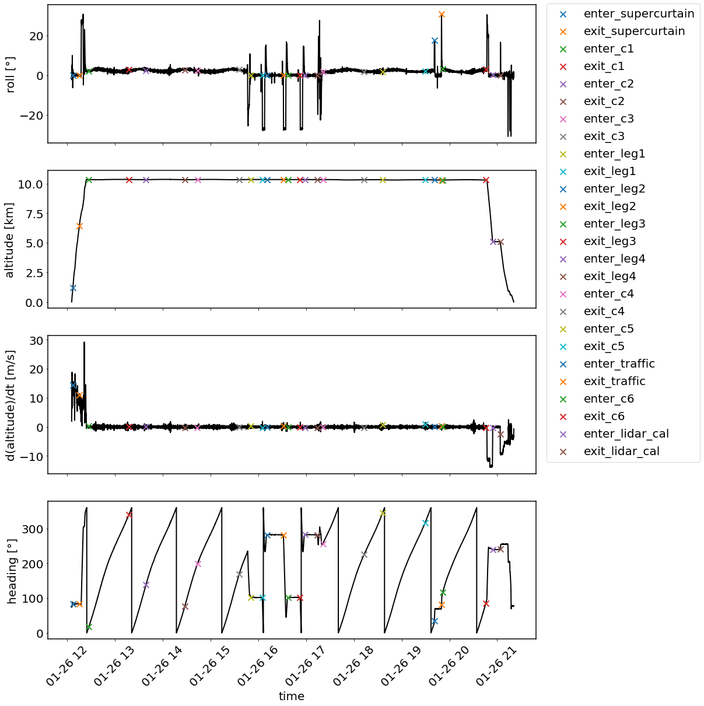

## Segmentation of HALO flights during EUREC4A

The HALO Research Flights (RFs) during EUREC4A can be divided into different segments. 
For example circles and straight legs were purposefully conducted maneuvers during which 
a distinct sampling behaviour of the various instruments can be assumed. For future analyses
based on specific kinds of flight segments (e.g. only based on circles) it is desired to use a 
common set of start- and end-times to assure consistency between the studies. This repository 
provides the start- and end-times of the flight-segments for each RF together with some  very 
general information about the RF or special events during the RF.

## Methodology to determine flight segments

A flight segment is a period of some constant characteristics during a RF. For example during a 
circle segment, the roll angle and the temporal change in aircraft heading can be assumed to be
constant. The circles during EUREC4A were especially associated with the regular launch of 
dropsondes, most of the time 12 per circle, every 30 ° heading. Such general characteristics 
of the various flight segments and a first idea about the flight patterns from the flight
reports (available on [aeris](https://observations.ipsl.fr/aeris/eurec4a/#/)) are used as a starting point
to approach the flight phase segmentation. The BAHAMAS datasets and the dropsonde launch 
times are then analysed to consistently determine the specific flight segment timestamps. For this 
purpose, BAHAMAS and dropsonde datasets provided by Heike Konow that are projected on a 
unified (time, lat, lon) grid are used, which are for example available on this ftp server:

> ftp-projects.mpimet.mpg.de

The following flight segments are identified, where names in brackets directly correspond to the 
segment-kinds in the YAML files. The criteria to determine the start- and end-times of the segments 
are noted below each flight segment.

#### circle (circle):
- Defined via launch times of first and last dropsonde during each of the circles.
- A circle typically ranges over 330° rather than 360°, because the final dropsonde of a circle is launched
30° ahead of the geometrical circle closure.
- If the first or final dropsonde is missing (e.g. due to instrument failure), the circle starts or closes with the 
first or last available dropsonde.
- The circle is defined this way because it appears most conservative with regard to comparability between
dropsonde and remote sensing data within a circle.

#### circle break (circle_break):
- Periods between two consecutive circles, during which no dropsondes were launched.
- Circle breaks stand out to breaks between for example a circle and a straight-leg because during these it 
is assured that the aircraft remained on the circle track.
- Defined by launch times of last dropsonde of previous circle and first dropsonde of next circle.
- Circle breaks may be used to obtain all the available remote sensing data from circles, neglecting availability 
of dropsonde data.

#### straight leg (straight_leg):
- Period with constant aircraft heading and close to 0° roll angle.
- Straight legs were flown with various purposes, which are more closely described by the straight leg 
"name"-Parameter in the YAML files.

#### lidar calibration (lidar_calibration):
- Maneuver typically conducted during the final descent of most RFs in FL160.
- Defined as the period of the aircraft being in FL160.

#### radar calibration with wiggle (radar_calibration_wiggle):
- Maneuver typically conducted during straight legs, where the aircraft tilts to a roll angle of first -20° and then +20°.
- For these cases, the straight leg is split into three flight segments: 1.) straight_leg, 2.) radar_cal_wiggle, 3.) straight_leg.
- The "rad_cal_wiggle" period is constrained to the period where the aircraft roll angle deviates from 0° and the heading is
not constant.

#### radar calibration with constant bank (radar_calibration_tilted):
- Maneuver typically conducted at the end of a straight leg, where a narrow circle pattern with a constant 10° bank is flown.
- A constant roll angle of 10° is used to define the period of a "radar_cal_tilted" segment.

These criteria are applied by making use of the FlightPhaseTools.py python module in jupyter 
notebooks for each individual RF. This module rather provides useful functions to search for the 
start- and end-times of the flight segments than to automate this process. To validate whether the 
found timestamps for the different segments are plausible, they are scattered into a set of standard 
BAHAMAS timeseries. An example is given below. 

It is clear that this process is to some degree always going to be subjective, but due to the individuality 
of the different RFs (unforeseeable track-deviations, dropsonde failures, complexity of maneuvers) and the managable 
amount of them, this methodology appears plausible.

**Note on data format**: It is strongly encouraged to use the provided YAML files since they best reflect the 
structure of the gathered meta-data. For python users, a reader method for the YAML files is directly included in the provided
 ResearchFlight class ("from_yaml"). For users still insisting on the use of NetCDF data, please contact the dataset creator.
 
